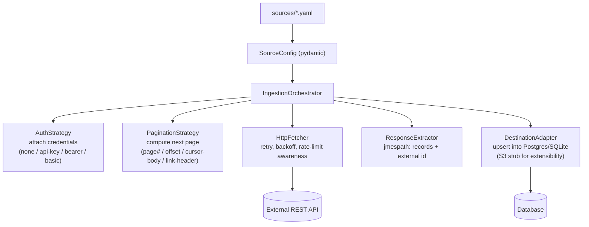

# Generic Data Ingestion Service

Config-driven service that ingests data from arbitrary REST APIs and stores
it in a database. **Adding a new source = a new YAML file, not new code.**

Built for the Intentwise "AI-Native Software Engineer" take-home assignment.

## Run it

```bash
git clone <this-repo> && cd intentwise-ingestion
cp .env.example .env   # add GITHUB_TOKEN if you want authenticated GitHub calls
docker compose up -d --build
docker compose ps      # wait until both services show healthy/running
```

Two containers start: `db` (Postgres) and `app` (FastAPI on `:8000`). Schema
is created automatically on startup — no manual migration step.

```bash
curl http://localhost:8000/health                                   # confirm it's up
curl http://localhost:8000/sources                                  # list configured sources
curl -X POST http://localhost:8000/sources/github_issues/ingest     # trigger a run
curl -X POST http://localhost:8000/sources/rickandmorty_characters/ingest
curl -X POST http://localhost:8000/sources/nasa_apod/ingest
curl http://localhost:8000/runs/1                                   # run status/metrics
curl http://localhost:8000/runs/1/records                           # sample stored records
```

Interactive API docs (Swagger UI): `http://localhost:8000/docs`.

Run the automated test suite (34 tests: auth, pagination, extractor, fetcher):

```bash
docker compose exec app pytest -q
```

Inspect the database directly, if desired:

```bash
docker compose exec db psql -U ingestion -d ingestion \
  -c "SELECT source_name, count(*) FROM raw_records GROUP BY source_name;"
```

Shut down when done: `docker compose down` (add `-v` to also wipe the DB volume).

**New source, no code changes:** drop a YAML file in `sources/` (see
existing ones as templates), then `docker compose restart app` and it
appears in `GET /sources` automatically.

## Demo APIs

Chosen to differ on both auth and pagination style, proving the design isn't
tailored to one API:

| Source | Auth | Pagination | Response shape |
|---|---|---|---|
| GitHub Issues API | Bearer token | `Link` header (`rel="next"`) | bare array |
| Rick and Morty API | None | next-URL in body (`info.next`) | `{info, results}` |
| NASA APOD API | API key in query param | none (batch via `count`) | bare array |

## Architecture



**Strategy pattern for auth & pagination** — each is an ABC + `factory(config)`
keyed off a `type` field. A new API using an *existing* style needs zero
code, just config. A genuinely new mechanism needs one new class, isolated
to `app/auth.py` or `app/pagination.py` — never the orchestrator.

**Schema-agnostic storage** — `raw_records.payload` is a JSON column holding
the whole record, plus lineage columns (`source_name`, `external_id`,
`run_id`, timestamps). No schema change needed per source.

**Idempotent upserts** — unique constraint on `(source_name, external_id)` +
`ON CONFLICT DO UPDATE`, so re-running never duplicates.

**Centralized resilience** (`HttpFetcher`, shared by every source) —
exponential backoff + jitter on 429/5xx/timeouts only (never other 4xx),
`Retry-After` handling, proactive throttling on `X-RateLimit-Remaining`,
concurrency cap, and a descriptive `User-Agent`.

**Run tracking & partial-failure tolerance** — every run is an
`IngestionRun` row (pages/records fetched/saved/skipped, checkpoint, error).
A bad record is skipped, not fatal; a page/network failure yields
`partial`/`failed` instead of crashing.

**Pagination safety** — every config has `max_pages`, and the orchestrator
also stops on an empty page, guarding against infinite loops.

## Tradeoffs & assumptions

- SQLite by default (zero setup); docker-compose wires up real Postgres.
- Three demo sources, chosen for depth (genuinely different auth/pagination) over breadth.
- jmespath for all path config (`records_path`, `external_id_path`, etc.) instead of a custom DSL.
- S3 destination is a schema/interface stub, not implemented — ingestion resilience was prioritized per the assignment's emphasis on "handling the realities of live APIs."
- No OAuth2-refresh auth strategy yet — bearer/API-key/basic cover the demo APIs.
- Ingestion runs synchronously inline with the trigger request, not on a background queue.
- Sources load from disk once at startup; a new YAML needs an app restart.

## With more time

- Real S3 `DestinationAdapter` implementation.
- `/sources/reload` endpoint so new YAML is picked up without a restart.
- Background task queue (Celery/RQ) + scheduler for recurring syncs.
- OAuth2-with-refresh auth strategy.
- Structured logging/metrics (OpenTelemetry/Prometheus).
- Config validation CLI (dry-run a new source's first page before wiring it in).
- Host the service publicly instead of relying only on docker-compose.
- Property-based tests for pagination strategies (Hypothesis).

## AI usage note

Built with GitHub Copilot CLI for scaffolding and design discussion; all
code reviewed, run, and debugged by me.

**A real mistake it made, and how I caught it:** `HttpFetcher` set a default
`User-Agent` on the shared `httpx.AsyncClient`, assuming `client.send(request)`
merges the client's default headers onto any request. That's wrong —
`send()` only merges defaults for requests built via `client.build_request()`;
a manually-constructed `httpx.Request()` goes out exactly as built.

It didn't show up in isolation — only once I ran the live demo in Docker:
Rick and Morty ingested fine, but GitHub returned `403 Forbidden: "...make
sure your request has a User-Agent header..."`. I first suspected the
bearer token, so I isolated it by testing the same request three ways
inside the container: a bare `httpx.get()` with headers set by hand (200
OK), inspecting the `Authorization` header our own `auth.py` built (correct),
then running it through `HttpFetcher.fetch()` (403). That pinpointed the
fetcher, not the token or auth strategy.

**Fix:** `HttpFetcher.fetch()` now merges the client's default headers onto
the outgoing request via `request.headers.setdefault(...)` before sending,
so `User-Agent` is always present while still letting source-specific
headers (e.g. `Authorization`) take precedence. Exactly the kind of
live-API-only failure mode the assignment calls out — invisible with mocked
tests, only visible against a real production server.

